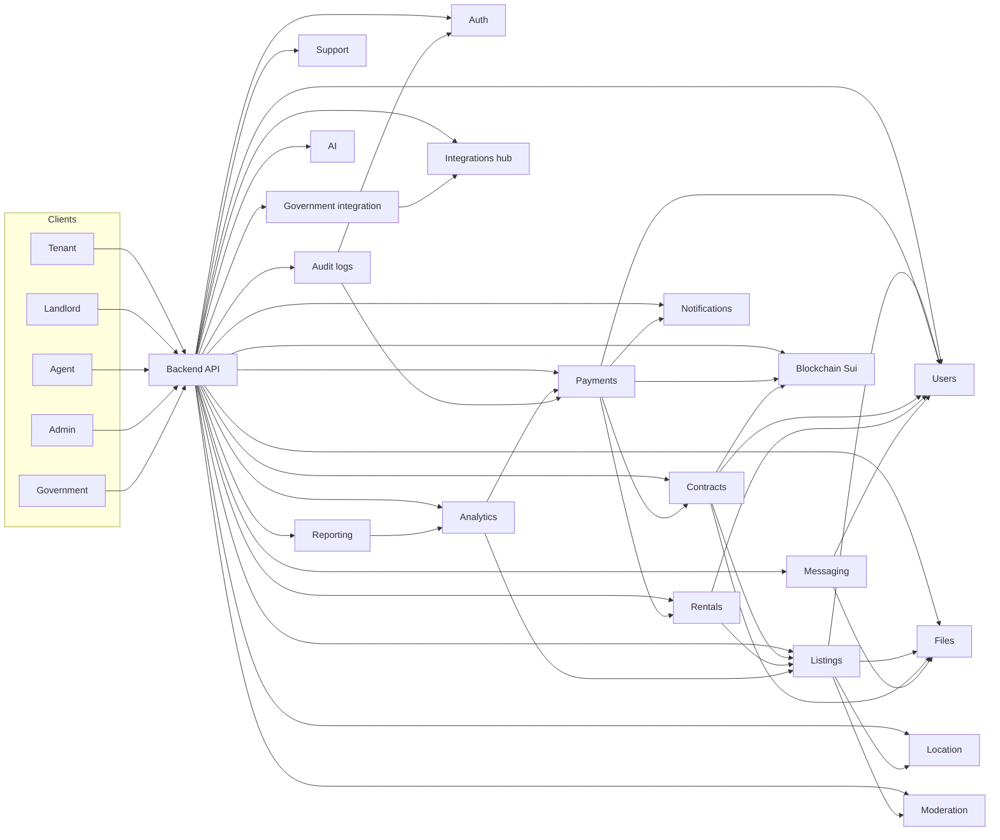

# RentDirect UG — Dashboard UIs, Module Communication, and Flows

This document describes **how the five UIs communicate**: not to each other directly, but through the **shared backend**, **Notifications**, **Files (Walrus)**, **Integrations Hub**, and **Blockchain (Sui)**—aligned with the RentDirect system diagram.

## 1. Communication model (how every UI “talks”)

| Layer | Role |
|--------|------|
| **Client UIs** | Tenant / Landlord / Agent (mobile), Admin / Government (web). They only call your **API** and subscribe to **push / in-app / email / SMS** as needed. |
| **Backend API** | Single source of business rules, authorization, orchestration, and persistence (**PostgreSQL**). |
| **Redis** | Sessions, rate limits, caches, pub/sub for real-time features (e.g. chat presence) where you add them. |
| **Notifications module** | Fan-out hub: almost every domain event should emit notifications (in-app, push, SMS, email). **All dashboards consume notifications.** |
| **Files & uploads** | Binary truth for images, IDs, contracts, receipts. Clients upload via API; API stores metadata in DB and **blob content on Walrus** (or interim storage) with a **content address / URI** returned to clients. |
| **Blockchain (Sui)** | Anchors: hashes, object IDs, transaction digests for **payments verification**, **contract attestations**, **ownership / rental proofs**. UIs show “verified on-chain” using data the API returns—not by talking to Sui directly from every screen (unless you add a read-only client SDK later). |
| **Integrations Hub** | Outbound **webhooks**, third-party CRM, email/SMS gateways, payment provider callbacks (MoMo, Airtel, card). **No UI calls MoMo directly**; payment UI → API → provider → webhook → API updates state → **Notifications** + optional **Blockchain** record. |
| **Government integration** | Admin/Government UIs trigger or view **sync jobs** and **reports**; implementation goes through API + Integrations Hub, not hard-coded in the web bundle. |
| **Audit logs** | Every sensitive action across dashboards is logged server-side for Admin (full) and Government (limited) read APIs. |

**Rule:** UIs **never** trust each other. They trust **tokens (Auth)** + **server responses** + **immutable references** (Walrus + Sui) returned by the API.

---

## 2. Dashboard → modules matrix (who touches what)

Legend: **R** = read, **W** = write/create/update, **M** = moderate / operational override

| Module | Tenant mobile | Landlord mobile | Agent mobile | Admin web | Government web |
|--------|---------------|-----------------|--------------|-----------|------------------|
| **Auth** | W (login, OTP, session) | W | W | W | W |
| **Users** | R/W (own profile) | R/W (own) | R/W (own) | M (all users) | R (limited / verified views) |
| **Listings** | R (browse), R (detail) | W (own CRUD) | R (browse, leads) | M (moderation) | R (aggregates / compliance views) |
| **Location & map** | R (search, nearby) | W (property pin) | R | R | R/W (planning datasets policy) |
| **Payments** | W (pay), R (history) | R (receive), R (payouts) | R (assisted deals) | M (monitor, refund ops) | R (tax / export aggregates) |
| **Contracts** | R/W (sign, view) | W (create, manage) | R (linked to deal) | M (audit) | R (oversight exports) |
| **Rent management** | R/W (own tenancy) | W (managed units) | R | M | R |
| **Notifications** | R | R | R | R (broadcast config) | R |
| **Chat / messaging** | W (tenant↔landlord) | W | W (agent↔client) | M (moderation) | — |
| **Files & uploads** | W (IDs, receipts) | W (photos, docs) | W (deal docs) | R/M | R (policy-bound) |
| **Government integration** | — | — | — | M (technical ops) | W/R (URA/NIRA/KCCA flows) |
| **Analytics** | R (limited) | R (landlord stats) | R (leads/deals) | R/W | R |
| **Moderation** | R (report) | R (report) | R | M | R (flags overview) |
| **AI recommendations** | R | R (pricing hints) | R | M | R |
| **Blockchain** | R (proofs shown in app) | R | R | M | R (verify attestations) |
| **Reporting** | R (own exports) | R | R | W | W |
| **System settings** | — | — | — | W | R (policy flags) |
| **Support & tickets** | W | W | W | M | R |
| **Audit logs** | — | — | — | R | R (limited) |
| **Integrations hub** | — | — | — | M | M (gateway config) |

---

## 3. End-to-end flows (cross-UI communication)

Each flow is: **UI A → API → modules → optional Walrus/Sui → Notifications → UI B**.

### 3.1 Listing publish (Landlord → Admin → Tenant)

1. **Landlord mobile**: **Files** upload images → **Listings** create draft → **Location** set pin → submit.  
2. **Moderation** + optional **AI** score → **Admin web** reviews → approve/reject.  
3. On approve: **Listings** state = live; **Notifications** → tenant segments / saved search; **Audit logs** record decision.  
4. **Tenant mobile**: **Listings** + **Location** read-only browse.

### 3.2 Rent payment (Tenant → Payments → Landlord + Blockchain optional)

1. **Tenant mobile**: initiate **Payments** (MoMo / Airtel / card) via API.  
2. API → provider → **Integrations hub** webhook/callback → **Payments** status = completed.  
3. **Rent management** ledger updated; **Notifications** → landlord (and tenant receipt).  
4. Optional: **Blockchain** writes digest / object reference; **Files** stores PDF receipt on **Walrus**; DB stores pointers.  
5. **Landlord mobile**: sees incoming payment in **Payments** / **Rent management**.

### 3.3 Contract lifecycle (Landlord ↔ Tenant ↔ Walrus ↔ Sui)

1. **Landlord**: **Contracts** from template, attach **Listings** + **Rent** terms.  
2. **Files**: PDF stored on **Walrus**; hash in DB.  
3. **Tenant**: review → e-sign API → **Contracts** status; **Notifications** to landlord.  
4. Optional: **Blockchain** notarization (Sui object / tx digest); UI shows verification badge.  
5. **Admin** / **Government**: read via **Reporting** + **Audit logs** (role-scoped).

### 3.4 Messaging (Tenant ↔ Landlord, Agent ↔ parties)

1. **Messaging** persists threads and attachments metadata; large blobs → **Files** / Walrus.  
2. **Notifications** for new messages (push + in-app).  
3. **Admin**: **Moderation** tools on flagged threads only.

### 3.5 Support ticket (Tenant / Landlord → Admin)

1. Mobile **Support** creates ticket.  
2. **Notifications** to admin queue.  
3. **Admin web**: **Support** manage + **Audit logs** trail.  
4. Optional: **Integrations hub** → external CRM.

### 3.6 Government / compliance (Government web ↔ Integrations ↔ Analytics)

1. **Government web** requests report or verification job.  
2. **Government integration** + **Integrations hub** call URA / NIRA / KCCA patterns (async).  
3. Results stored in DB + **Reporting** exports; **Audit logs** who accessed what.  
4. **Admin** monitors integration health in **Settings** + **Integrations hub**.

### 3.7 Fraud / scam pipeline (any UI → Moderation → all)

1. Any role submits **Moderation** report.  
2. **AI** optional scoring; **Moderation** case queue on **Admin**.  
3. Outcome: listing/user restricted; **Notifications** to affected parties; **Audit logs** mandatory.

---

## 4. Module-to-module dependency (backend wiring)

High-level directed dependencies (implement as services / events, not circular imports):

**Notifications** should subscribe (conceptually) to events from: Listings, Payments, Contracts, Rent management, Messaging, Moderation, Support, Government jobs, Blockchain confirmations.

---

## 5. Sui + Walrus in the same story

| Concern | Primary store | What the UI displays |
|---------|----------------|------------------------|
| Searchable business data | PostgreSQL | Lists, statuses, balances, roles |
| Large / immutable files | Walrus (content-addressed) | Image/contract links, checksums |
| Public verifiable anchor | Sui | Tx digest, object ID, “verified” state returned by API |

Clients render **API-composed DTOs** (e.g. `listing + primaryImageWalrusUri + optionalSuiAnchor`).

---

## 6. Implementation checklist (engineering)

1. **One API contract per module** (REST or RPC), versioned; mobile and web share DTOs where possible (`packages/` in monorepo).  
2. **RBAC** on every route: tenant vs landlord vs agent vs admin vs government scopes match the matrix above.  
3. **Idempotent webhooks** in **Integrations hub** for payments.  
4. **Outbox or job queue** for async: government pulls, Walrus uploads, Sui writes, heavy reports.  
5. **Audit logs** middleware on mutating routes.  
6. **Notifications** service API: `notify(userId, templateKey, payload)` called from other modules—not duplicated in controllers.

This is the communication blueprint your UIs should follow: **diagram features map to modules; modules orchestrate data, files, chain, and integrations; all dashboards converge on the same APIs and notification streams.**
